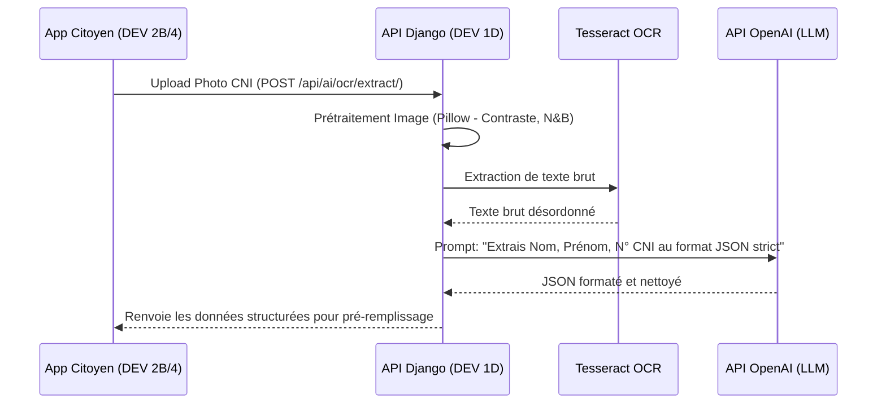

# 🧠 TERANGA CIVIL — Architecture IA & OCR (OpenAI + Tesseract)

Ce document détaille l'architecture technique du module Intelligence Artificielle et Reconnaissance Optique de Caractères (OCR) développé par **Lansana Coly (DEV 1A)** et **Ibrahima Khalilou Diallo alias Kalz (DEV 1D)**. 

Il explique comment l'API OpenAI est intégrée pour transformer notre application en une véritable plateforme "GovTech Intelligente".

---

## 🌟 La Vision (Pour l'encadreur)

L'IA n'est pas un simple gadget dans TERANGA CIVIL, c'est le **moteur qui réduit la fracture numérique**. De nombreux citoyens sénégalais peuvent avoir des difficultés à remplir des formulaires administratifs complexes. 

Notre solution repose sur deux piliers :
1. **OCR + IA Structurante** : Le citoyen prend sa carte d'identité en photo, Tesseract lit le texte brut, et OpenAI le structure intelligemment pour pré-remplir les formulaires à sa place. Zéro saisie manuelle.
2. **Ndiogoye (Assistant Conversationnel)** : Un chatbot dopé à GPT-3.5/GPT-4 qui comprend le langage naturel (y compris le Wolof francisé ou les fautes de frappe), identifie l'intention du citoyen, et le guide pas-à-pas vers la bonne démarche.

---

## 1️⃣ Pipeline OCR Intelligent (Image → Données Structurées)

Actuellement, notre système utilise `pytesseract` pour extraire le texte brut. Le texte brut d'une CNI sénégalaise est très désordonné. Voici comment nous allons utiliser OpenAI pour le structurer.

### Architecture du flux


### Le code cible (DEV 1D - `apps/ai/ocr.py`)
Au lieu de renvoyer le texte brut, nous appelons OpenAI (modèle `gpt-3.5-turbo` pour la rapidité/coût) pour parser la donnée :

```python
import openai
from django.conf import settings

openai.api_key = settings.OPENAI_API_KEY

def parse_cni_with_openai(raw_text):
    """Utilise OpenAI pour structurer le texte brut de l'OCR Tesseract."""
    prompt = f"""
    Voici le texte brut extrait d'une carte d'identité sénégalaise via OCR :
    ---
    {raw_text}
    ---
    Ta tâche est d'extraire les informations exactes et de les renvoyer UNIQUEMENT sous forme de JSON valide.
    Les clés attendues sont : "prenom", "nom", "date_naissance", "lieu_naissance", "numero_cni".
    Si une information est illisible, mets null.
    """
    
    response = openai.ChatCompletion.create(
        model="gpt-3.5-turbo",
        messages=[
            {"role": "system", "content": "Tu es un assistant spécialisé dans l'extraction de données administratives sénégalaises."},
            {"role": "user", "content": prompt}
        ],
        temperature=0.0 # Température 0 pour être déterministe et factuel
    )
    
    return response.choices[0].message.content # Retourne le JSON
```

---

## 2️⃣ Ndiogoye — Assistant Conversationnel Autonome

L'actuel `faq.py` utilise des expressions régulières (`regex`). C'est trop rigide. Nous allons transformer **Ndiogoye** en un agent conversationnel qui détecte des "Intentions" (Intents).

### Architecture du flux
```mermaid
graph TD
    A[Message Citoyen : "Slt je vx un extrait pour mn fils"] --> B[Endpoint: /api/ai/ndiogoye/chat/]
    B --> C[API OpenAI]
    C -->|Analyse NLP| D{Détection d'intention}
    D -->|creer_dossier_naissance| E[Action: start_dossier]
    D -->|suivi_dossier| F[Action: track_dossier]
    D -->|question_generale| G[Action: faq_answer]
    E --> H[Réponse formatée au Mobile]
```

### Le code cible (DEV 1A & 1D - `apps/ai/faq.py` / `chatbot.py`)
Nous utilisons la fonctionnalité de `Function Calling` (ou un prompt structuré) d'OpenAI pour forcer le LLM à retourner une structure actionnable par le Frontend.

```python
def chat_with_ndiogoye(user_message, conversation_history):
    """
    Agent Ndiogoye propulsé par OpenAI.
    """
    system_prompt = """
    Tu es Ndiogoye, l'assistant virtuel de TERANGA CIVIL (État Civil du Sénégal).
    Tu es poli, concis, et tu parles français (tu comprends le wolof basique).
    
    Ta mission est d'aider le citoyen. Tu dois TOUJOURS répondre en JSON strict avec cette structure :
    {
      "reply": "Ta réponse textuelle à afficher au citoyen",
      "action": "L'action technique à déclencher (start_dossier, track_dossier, faq, ou null)",
      "dossier_type": "birth_certificate, marriage_certificate, death_certificate, ou null"
    }
    """
    
    messages = [{"role": "system", "content": system_prompt}]
    messages.extend(conversation_history) # Pour garder la mémoire du chat
    messages.append({"role": "user", "content": user_message})

    response = openai.ChatCompletion.create(
        model="gpt-3.5-turbo",
        messages=messages,
        temperature=0.7
    )
    
    # Le frontend (DEV 2B / DEV 4) recevra le JSON. 
    # S'il voit "action": "start_dossier", il affichera un bouton "Commencer la démarche" !
    return response.choices[0].message.content 
```

---

## 🛠️ Répartition du travail (DEV 1A & DEV 1D)

Pour réussir cette intégration avant la démo :

| Développeur | Tâche Technique |
|-------------|-----------------|
| **Kalz (DEV 1D)** | **1.** Mettre au propre le code d'extraction d'image (Tesseract).<br>**2.** Écrire la fonction de parsing via l'API OpenAI (Prompt Engineering pour JSON).<br>**3.** Tester avec de vraies photos de CNI sénégalaises. |
| **Lansana (DEV 1A)** | **1.** Créer la vue Django (`POST /api/ai/ndiogoye/chat/`) gérant l'historique des conversations en session ou BDD.<br>**2.** Concevoir le System Prompt de Ndiogoye avec les formats de réponse JSON.<br>**3.** Sécuriser les appels (limites de requêtes pour éviter le spam d'API OpenAI). |
| **Ensemble** | Gérer le package `openai` Python, ajouter `OPENAI_API_KEY` dans le `.env`, et s'assurer que les réponses JSON ne "crasshent" pas (gestion des erreurs). |

---

## 💡 Arguments pour l'encadreur / Le Jury

Si l'encadreur ou le jury vous demande pourquoi utiliser OpenAI :
1. **Résilience aux données imparfaites** : Tesseract fait des fautes de frappe sur des photos floues. OpenAI corrige automatiquement ces fautes grâce au contexte.
2. **Accessibilité** : Le citoyen n'a plus besoin de connaître le jargon administratif ("jugement d'hérédité"). Il parle avec ses mots à Ndiogoye, qui fait la traduction technique.
3. **Mise sur le marché rapide** : Développer un modèle NLP local pour comprendre les intentions en français/wolof prendrait des mois. L'API OpenAI permet d'avoir un système de niveau mondial en 24h, idéal pour un MVP GovTech.
