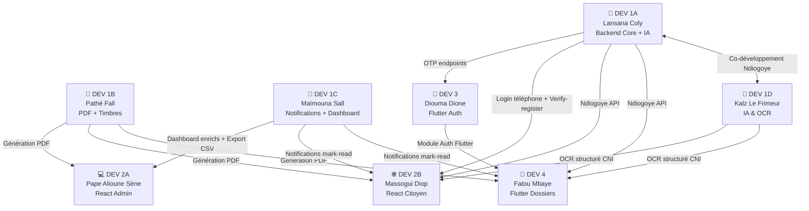
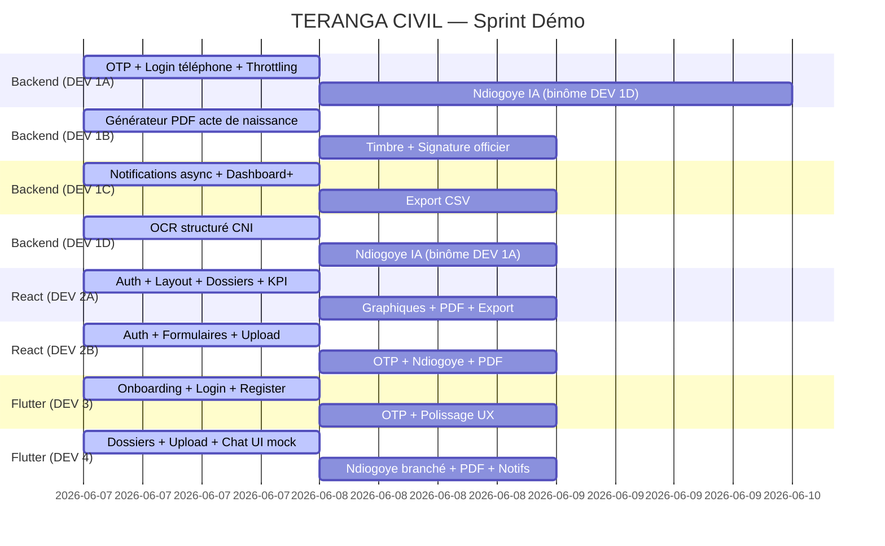

# 🗺️ TERANGA CIVIL — Carte des Dépendances Équipe

> Document de coordination mis à jour après l'audit QA — Branche `Developpe`

---

## Graphe des dépendances



---

## Légende des statuts

| Statut | Signification |
|--------|---------------|
| 🟢 **Libre** | Peut démarrer maintenant, aucune dépendance bloquante |
| 🟡 **Partiel** | Peut commencer certaines tâches mais pas toutes |
| 🔴 **Bloqué** | Attend une livraison d'un autre développeur |
| ✅ **Dispo** | Déjà livré et disponible dans la branche `Developpe` |

---

## DEV 1A — Lansana Coly · Backend Core + Co-IA

> [!IMPORTANT]
> DEV 1A **débloque 4 autres développeurs** (DEV 3, DEV 2B, DEV 4 pour OTP ; DEV 1D pour Ndiogoye).

### 🟢 Peut faire MAINTENANT

| Tâche | Pourquoi c'est débloqué |
|---|---|
| Système OTP — modèle `OTPCode` + endpoints `/api/auth/otp/` | Extension de l'auth existante ✅ |
| Login par téléphone (`phone` OU `email`) | Extension du serializer existant ✅ |
| Throttling anti brute-force sur `/api/auth/login/` | Config Django uniquement |
| Historique des connexions — `LoginHistory` + `GET /api/auth/login-history/` | Extension des signaux existants ✅ |
| Endpoint `verify-register` — tierce personne | Modèle Dossier déjà existant ✅ |

### 🟡 À coordonner avec DEV 1D

| Tâche | Note |
|---|---|
| Refonte Ndiogoye — intentions + contexte conversationnel | ⚠️ Développement **en binôme** avec DEV 1D — ne pas partir en silo |

### Ce que DEV 1A débloque

````carousel
**OTP terminé** → débloque DEV 3
- DEV 3 peut finaliser l'écran OTP (saisie 6 chiffres + minuterie)
- DEV 2B peut brancher la page d'inscription complète
<!-- slide -->
**Login téléphone actif** → débloque DEV 3 + DEV 2B
- Les formulaires mobiles et web peuvent ajouter le champ téléphone
<!-- slide -->
**`verify-register` livré** → débloque DEV 2B + DEV 4
- Le formulaire "demande pour une autre personne" peut être construit
<!-- slide -->
**Ndiogoye IA livrée** → débloque DEV 2B + DEV 4
- L'interface chat peut être branchée sur l'API réelle
````

---

## DEV 1B — Pathé Fall · PDF Officiels + Timbres + Signatures

> [!CAUTION]
> DEV 1B ne dépend de personne mais **tout le monde attend DEV 1B**. C'est la livraison la plus critique pour le jury — il veut voir un vrai acte généré.

### 🟢 Peut faire MAINTENANT

| Tâche | Pourquoi c'est débloqué |
|---|---|
| Générateur PDF `reportlab` — structure de base | `reportlab` déjà dans `requirements.txt` ✅ |
| Modèle `Timbre` — numéro unique, montant, hash cryptographique | Indépendant |
| Classe `CivilActPDFGenerator` pour les 3 types d'actes | Architecture pure Python |
| Endpoint `/api/documents/{id}/appliquer-timbre/` | Modèle `Document` déjà existant ✅ |

### 🟡 Auto-dépendances internes

| Tâche | Attend |
|---|---|
| QR Code embarqué dans le PDF | Le générateur PDF de base (ci-dessus) |
| Endpoint signature `/api/dossiers/{id}/signer/` | Modèle `OfficierSignature` à créer d'abord |

### Ce que DEV 1B débloque

| Livraison | Débloque |
|---|---|
| PDF généré pour un dossier complet | DEV 2A — bouton "Générer PDF" dans la liste |
| PDF généré pour un dossier complet | DEV 2B — bouton "Télécharger mon acte" |
| PDF généré pour un dossier complet | DEV 4 — écran détail dossier Flutter |
| Timbre numérique implémenté | DEV 2A — affichage timbre dans le dashboard admin |

---

## DEV 1C — Maïmouna Sall · Notifications + Dashboard + Export

> [!NOTE]
> DEV 1C peut tout démarrer immédiatement. Son impact principal est sur le Dashboard admin (DEV 2A).

### 🟢 Peut faire MAINTENANT

| Tâche | Pourquoi c'est débloqué |
|---|---|
| Notifications asynchrones — `threading.Thread` dans `signals.py` | Modification locale uniquement |
| Endpoint `GET /api/notifications/` + `mark-read` | Modèle `Notification` existant ✅ |
| Dashboard enrichi — `dossiers_par_type`, `dossiers_par_commune`, top agents | Requêtes ORM sur données existantes ✅ |
| Export CSV — `GET /api/dashboard/export/?format=csv` | Python natif `csv`, aucune lib externe |

### 🟡 Partiellement bloqué

| Tâche | Attend |
|---|---|
| Notifier à la signature du document | Endpoint signature de DEV 1B |

### Ce que DEV 1C débloque

| Livraison | Débloque |
|---|---|
| Dashboard enrichi livré | DEV 2A — tous les graphiques avancés |
| Export CSV livré | DEV 2A — bouton d'export |
| Notifications `mark-read` | DEV 2B et DEV 4 — centre de notifications |

---

## DEV 1D — Kalz Le Frimeur · IA & OCR + Co-Ndiogoye

> [!NOTE]
> DEV 1D peut avancer fort sur l'OCR sans personne. Ndiogoye se fait **en binôme avec DEV 1A**.

### 🟢 Peut faire MAINTENANT

| Tâche | Pourquoi c'est débloqué |
|---|---|
| Extraction structurée CNI — Nom, Prénom, N° doc, Dates | Amélioration de `ocr.py` existant ✅ |
| Pré-traitement image avant OCR — niveaux de gris, binarisation | `Pillow` déjà installé ✅ |
| Endpoint confirmation OCR — l'utilisateur valide avant enregistrement | Extension de `views.py` IA existant ✅ |
| Détection de doublons par hash SHA-256 du fichier | Extension de `validators.py` ✅ |

### 🟡 À coordonner avec DEV 1A

| Tâche | Note |
|---|---|
| Ndiogoye conversationnel — intentions + contexte | ⚠️ Développement **en binôme** avec DEV 1A |

### Ce que DEV 1D débloque

| Livraison | Débloque |
|---|---|
| Extraction CNI structurée | DEV 2B — pré-remplissage automatique des formulaires |
| Extraction CNI structurée | DEV 4 — pré-remplissage après scan photo mobile |
| Ndiogoye IA conversationnelle | DEV 2B + DEV 4 — interface chat branchée sur l'API |

---

## DEV 2A — Pape Alioune Sène · Dashboard React Admin

> [!TIP]
> DEV 2A a **~70% de son travail débloqué dès maintenant**. Pas besoin d'attendre pour démarrer.

### 🟢 Peut faire MAINTENANT

| Tâche | Endpoint disponible |
|---|---|
| Architecture React + Routing + Layout + Sidebar | Pur frontend |
| Authentification admin — Login / Logout / Refresh | `POST /api/auth/login/` ✅ |
| Intercepteur Axios — JWT inject + refresh auto + redirect 401 | Auth ✅ |
| CRUD Communes | `GET/POST/PUT/DELETE /api/communes/` ✅ |
| CRUD Agents/Utilisateurs | `GET/POST /api/users/` ✅ |
| Liste des dossiers avec filtres et pagination | `GET /api/dossiers/` ✅ |
| Détail dossier + changement de statut | `PATCH /api/dossiers/{id}/` ✅ |
| Logs d'audit | `GET /api/audit-logs/` ✅ |
| Cards KPI de base — total, en attente, traités | `GET /api/dashboard/stats/` ✅ |

### 🟡 Bloqué — attend ces livraisons

| Tâche | Attend | Dev |
|---|---|---|
| Graphiques enrichis — par type, par commune, top agents | Dashboard enrichi | DEV 1C |
| Bouton "Générer PDF" | Endpoint PDF | DEV 1B |
| Bouton "Export CSV" | `GET /api/dashboard/export/` | DEV 1C |
| Affichage timbres numériques | Modèle `Timbre` | DEV 1B |

---

## DEV 2B — Massogui Diop · React Frontend Citoyen

> [!TIP]
> DEV 2B peut construire **toutes les UI en avance** avec des mocks, et brancher les APIs dès qu'elles arrivent.

### 🟢 Peut faire MAINTENANT

| Tâche | Endpoint disponible |
|---|---|
| Landing page publique | Pur frontend |
| Architecture React + Routing citoyen | Pur frontend |
| Page Login | `POST /api/auth/login/` ✅ |
| Page Inscription (sans OTP pour l'instant) | `POST /api/auth/register/` ✅ |
| Page "Mes dossiers" | `GET /api/dossiers/` ✅ |
| Détail dossier + timeline de progression | `GET /api/dossiers/{id}/` ✅ |
| Upload de documents — drag&drop, progression | `POST /api/documents/upload/` ✅ |
| Vérification publique QR Code | `GET /api/qr/verify/{ref}/` ✅ |

### 🟡 Bloqué — attend ces livraisons

| Tâche | Attend | Dev |
|---|---|---|
| Inscription avec OTP | Endpoints `/api/auth/otp/` | DEV 1A |
| Login par téléphone | Adaptation backend | DEV 1A |
| Bouton "Télécharger mon acte" | Endpoint PDF | DEV 1B |
| Formulaire tierce personne | `verify-register` | DEV 1A |
| Pré-remplissage formulaire via OCR | `/api/ai/ocr/confirm/` | DEV 1D |
| Chat Ndiogoye branché | `/api/ai/ndiogoye/chat/` | DEV 1A + DEV 1D |

> [!TIP]
> **Astuce** : Construire l'interface chat Ndiogoye et l'écran OTP en UI avec des réponses mockées. Il suffit de connecter l'endpoint quand il arrive — gain de temps énorme.

---

## DEV 3 — Diouma Dione · Flutter Auth + Onboarding

### 🟢 Peut faire MAINTENANT

| Tâche | Pourquoi c'est débloqué |
|---|---|
| Onboarding — 3 slides + `SharedPreferences` | Pur Flutter, aucune API |
| `SplashScreen` + logique de redirection | Architecture locale |
| Écran Login | `POST /api/auth/login/` ✅ |
| Écran Register | `POST /api/auth/register/` ✅ |
| Page d'accueil — résumé dossiers actifs | `GET /api/dossiers/` ✅ |
| Intercepteur Dio — JWT + refresh auto | Auth ✅ |
| Gestion token `flutter_secure_storage` | Pur Flutter |

### 🟡 Bloqué — attend ces livraisons

| Tâche | Attend | Dev |
|---|---|---|
| Écran OTP — saisie + renvoi + validation | Endpoints OTP | DEV 1A |
| Login par numéro de téléphone | Adaptation backend login | DEV 1A |

### Ce que DEV 3 débloque

| Livraison | Débloque |
|---|---|
| Module Auth Flutter complet (Login / Register / Token / OTP) | DEV 4 peut se connecter au module auth sans le redévelopper |

---

## DEV 4 — Fatou Mbaye · Flutter Dossiers + Ndiogoye

> [!TIP]
> DEV 4 peut construire toute l'UI avec des données mockées **sans attendre DEV 3**. Il suffit de brancher le module auth quand il arrive.

### 🟢 Peut faire MAINTENANT

| Tâche | Pourquoi c'est débloqué |
|---|---|
| Liste des dossiers avec pull-to-refresh | `GET /api/dossiers/` ✅ |
| Détail dossier — timeline, statut, dates | `GET /api/dossiers/{id}/` ✅ |
| Upload documents mobile — `image_picker` | `POST /api/documents/upload/` ✅ |
| Stepper "Nouvelle demande" — UI étapes 1 à 3 | Formulaires définis dans le CDC |
| Interface Chat Ndiogoye — UI avec réponses mockées | Peut mocker en attendant l'API |
| Configuration Firebase — token FCM + enregistrement device | `POST /api/notifications/register-device/` ✅ |

### 🟡 Bloqué — attend ces livraisons

| Tâche | Attend | Dev |
|---|---|---|
| Auth flow complet Flutter | Module Auth | DEV 3 |
| Bouton "Télécharger mon acte" | Endpoint PDF | DEV 1B |
| Pré-remplissage formulaire via scan CNI | OCR structuré | DEV 1D |
| Chat Ndiogoye branché sur API réelle | `/api/ai/ndiogoye/chat/` | DEV 1A + DEV 1D |

---

## Tableau de criticité globale

| Dev | Bloque qui ? | Critique pour la démo ? |
|---|---|---|
| **DEV 1A** | DEV 3 · DEV 2B · DEV 4 · DEV 1D | 🚨 OUI — OTP requis pour la démo inscription |
| **DEV 1B** | DEV 2A · DEV 2B · DEV 4 | 🚨 OUI — Le jury veut voir un acte généré |
| **DEV 1C** | DEV 2A | ⚠️ MOYEN — Le dashboard de base fonctionne déjà |
| **DEV 1D** | DEV 2B · DEV 4 | 🚨 OUI — L'IA est l'argument phare pour le jury |
| **DEV 3** | DEV 4 | ⚠️ MOYEN — DEV 4 peut mocker en attendant |
| **DEV 2A** | Personne | 🟢 NON — Consommateur final |
| **DEV 2B** | Personne | 🟢 NON — Consommateur final |
| **DEV 4** | Personne | 🟢 NON — Consommateur final |

---

## Planning recommandé



---

*Dernière mise à jour : 07 juin 2026 — Architecte DEV 1A (Lansana Coly)*

---

### Annuaire de l'équipe

| Dev | Nom | Rôle |
|-----|-----|------|
| DEV 1A | **Lansana Coly** | Backend Core + Co-IA |
| DEV 1B | **Pathé Fall** | PDF + Timbres + Signatures |
| DEV 1C | **Maïmouna Sall** | Notifications + Dashboard + Export |
| DEV 1D | **Kalz Le Frimeur** | IA & OCR + Co-Ndiogoye |
| DEV 2A | **Pape Alioune Sène** | Dashboard Admin React |
| DEV 2B | **Massogui Diop** | Frontend React Citoyen |
| DEV 3 | **Diouma Dione** | Flutter Auth + Onboarding |
| DEV 4 | **Fatou Mbaye** | Flutter Dossiers + Ndiogoye |
