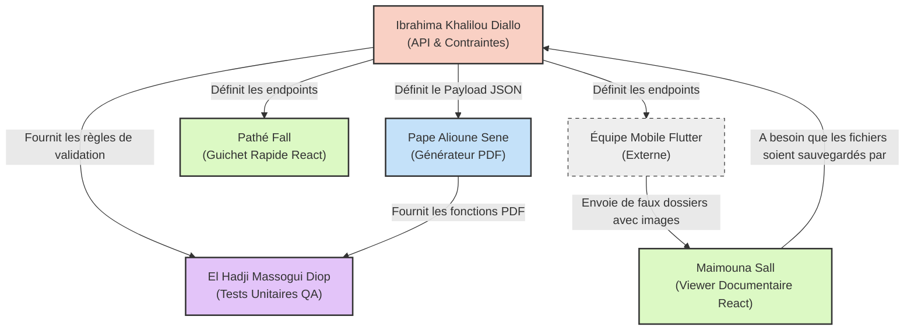

# Matrice des Dépendances : L'Équipe Teranga Civil

Pour que le développement se passe de manière fluide et sans blocage (goulot d'étranglement), voici comment vos tâches s'emboîtent.

## 📊 Graphe de Dépendances

---

## 🛠️ Explications du Flux de Travail

### 1. **Le point de départ (Le Bloqueur)** : IBRAHIMA (DEV 1D)
Ibrahima est le **pilier central**. Il doit être le premier à commencer. C'est lui qui configure l'API et dicte les contraintes (1 an max pour le décès, les pièces obligatoires).
**Personne ne l'attend pour commencer, mais tout le monde a besoin de son travail.**

### 2. **Les développeurs parallèles** : PAPE (DEV 2A) & PATHÉ (DEV 1B)
Dès qu'Ibrahima a défini la structure des données (les clés JSON comme `date_deces` ou `temoin_1`), **Pape** et **Pathé** peuvent travailler en parallèle :
- **Pape** code son PDF en lisant ce JSON.
- **Pathé** code le formulaire Web du "Guichet Rapide" pour envoyer ce JSON à l'API d'Ibrahima.

### 3. **Celle qui a besoin de "vraies" données** : MAIMOUNA (DEV 1C)
Maimouna développe l'interface pour vérifier les pièces d'identité et les certificats.
*Dépendance* : Elle a besoin qu'Ibrahima ait validé le backend, et que l'équipe Mobile (ou Pathé via le Guichet Rapide) ait soumis au moins un ou deux dossiers de tests avec de **vraies images** pour qu'elle puisse tester son "Viewer".

### 4. **Le filet de sécurité (Fin de chaîne)** : MASSOGUI (DEV 2B)
Massogui clôture le bal. Ses tests unitaires sont conçus pour attaquer et valider le code d'Ibrahima (bloqueur de date) et le code de Pape (génération de PDF).
*Dépendance* : Il écrit ses tests en dernier (ou fait du TDD en amont, mais ses tests ne seront verts que lorsque Ibrahima et Pape auront terminé).
